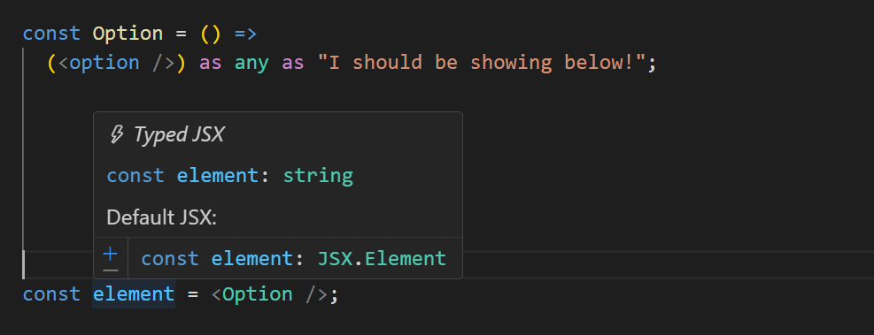
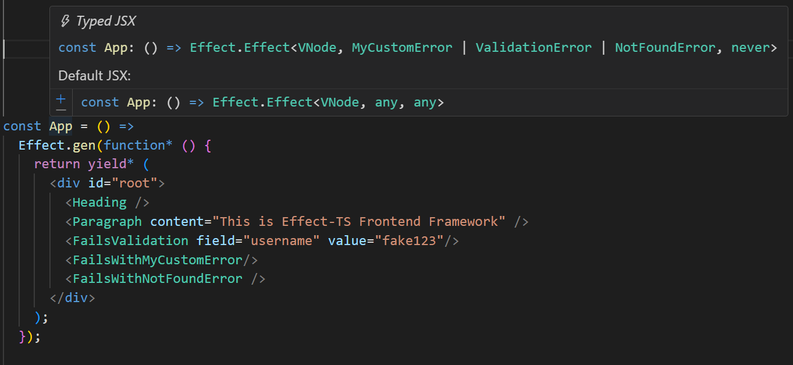
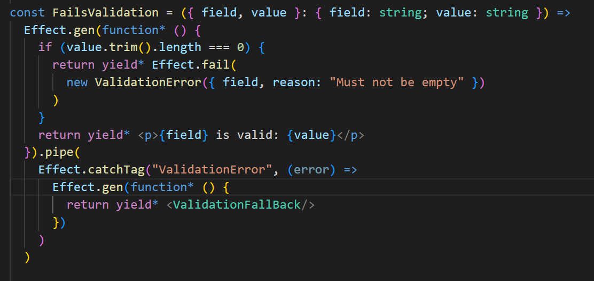
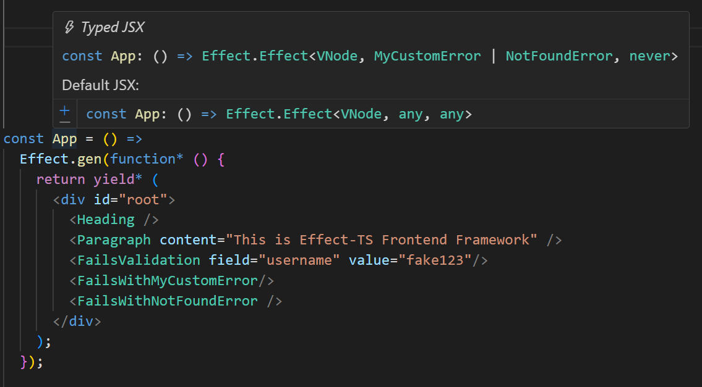

# Typed JSX Language Tools

### The problem
TypeScript treats JSX tags as `JSX.Element`. Type information of children gets lost.

```tsx
const Option = () =>
  (<option />) as any as "I should be showing below!";

const element = <Option />;

// Today, TypeScript sees this as:
const element: JSX.Element
```
More context: [Type-safe children in React and TypeScript](https://www.totaltypescript.com/type-safe-children-in-react-and-typescript).


But with the **typed-jsx-language-tools** the type is correct.



_Typed JSX vs Default behaviour_

### The solution
Instead of asking TypeScript to typecheck JSX directly, we:
- Transform JSX into plain TS.
- Get the TypeScript language service to typecheck that TS.
- Map the results back to the original TSX so hovers and diagnostics point to the right place.

This is similar to how Svelte handles `.svelte` files. See the Svelte language tools [overview](https://github.com/sveltejs/language-tools/blob/master/docs/internal/overview.md).


### Why should you care?
Apart from that it improves overall typesafety of JSX.

This allows us to build next level UI frameworks (with insane typesafety).
e.g. Based on [Effect-TS](https://effect.website/)



_This looks uglier than React. But have you noticed? We are tracking all
possible ways our UI can fail within the typesystem. (`MyCustomError`, `ValidationError`, `NotFoundError`)_



_We can catch a specific error and show a fallback UI_

After we took care of the error we only have two left


_After handling the `ValidationError`, typesystem shows two errors that we didn't handle yet. (`MyCustomError`, `NotFoundError`)_

### Current state
This thing barely works. I hope to get back to it whenever I have more free time.

If you have the right skillset to move things further, I would love to help, any way I can.