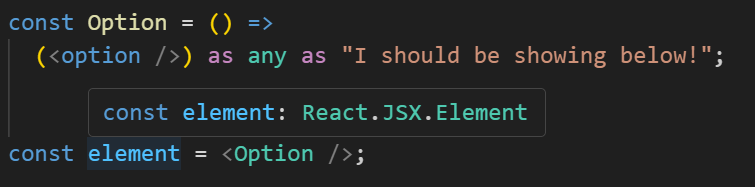

### The problem
TypeScript treats JSX tags as `JSX.Element`. Type information of children gets lost.

```tsx
const Option = () =>
  (<option />) as any as "I should be showing below!";

const element = <Option />;

// Today, TypeScript sees this as:
const element: JSX.Element
```



More context: [Type-safe children in React and TypeScript](https://www.totaltypescript.com/type-safe-children-in-react-and-typescript).

### The solution
Instead of asking TypeScript to typecheck JSX directly, we:
- Transform JSX into plain TS with source maps.
- Get the TypeScript language service to typecheck that TS.
- Map the results back to the original TSX so hovers and diagnostics point to the right place.

This is similar to how Svelte handles `.svelte` files. See the Svelte language tools [overview](https://github.com/sveltejs/language-tools/blob/master/docs/internal/overview.md).

For now this is done through language server. But also a solution should be made
for typechecking at compile time (ts-patch could work)

### Why should you care?
This improves typesafety of JSX.
e.g. You can restrict the type for Components children

But this allows building next gen frontend frameworks
for example: Based on Effect-TS https://effect.website/


You don't see just a happy path, but also what kinds of error components can fail with.

And showing different UI for different error, much
more easily.

### Current state
This thing is barely working. I hope to get back to it whenever I have some free time.

If you have the right skillset to move things further much faster, I would love to be helpful.